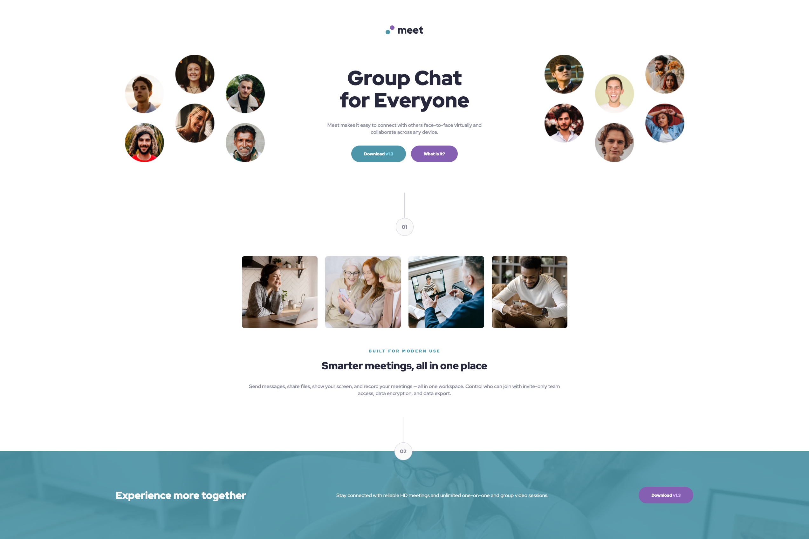

# Frontend Mentor - Meet landing page solution

This is a solution to the [Meet landing page challenge on Frontend Mentor](https://www.frontendmentor.io/challenges/meet-landing-page-rbTDS6OUR). Frontend Mentor challenges help you improve your coding skills by building realistic projects. 

## Table of contents

- [Frontend Mentor - Meet landing page solution](#frontend-mentor---meet-landing-page-solution)
  - [Table of contents](#table-of-contents)
  - [Overview](#overview)
    - [Screenshot](#screenshot)
    - [Links](#links)
  - [My process](#my-process)
    - [What I learned](#what-i-learned)
  - [Author](#author)

**Note: Delete this note and update the table of contents based on what sections you keep.**

## Overview

### Screenshot

### Links

- [Solution URL](https://github.com/nursh/FM-Meet-Landing-Page)
- [Live Site URL](https://nursh.github.io/FM-Meet-Landing-Page/)

## My process

### What I learned

I learnt about background-image and responsive design

## Author

- Frontend Mentor - [@nursh](https://www.frontendmentor.io/profile/nursh)